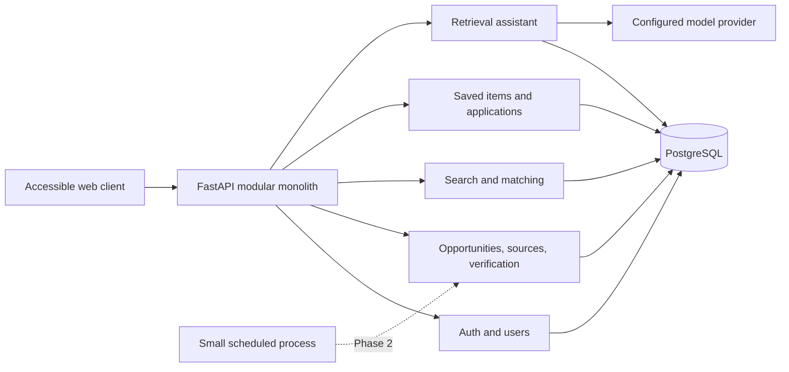
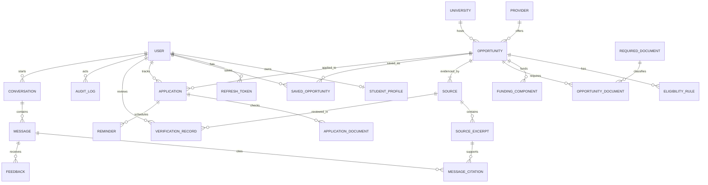

# Scholarship AI Assistant — MVP Blueprint

## 1. Complete MVP scope

The MVP proves one end-to-end promise: a student can securely create a profile,
find public opportunities backed by official sources, understand an
explainable match, save and track an application, and ask factual questions
whose answers cite the stored evidence.

### In scope

| Capability | Smallest useful MVP acceptance criterion |
|---|---|
| Authentication | Register, login, rotate/revoke sessions, protected routes, student/admin roles |
| Student profile | Create/update a partial profile; missing values remain unknown |
| Opportunity curation | Admin CRUD; structured funding and eligibility; draft/public lifecycle |
| Provenance | No public opportunity without an official source and last-verified date |
| Verification | Reviewer can approve, flag conflict, expire, and leave an auditable record |
| Ingestion | Admin form plus validated CSV/JSON import, dry-run report, duplicate warnings |
| Search | Testable structured filters, pagination, sorting, and keyword search |
| Matching | Deterministic eligibility gates plus explainable weighted score; never admission probability |
| Tracking | Save, notes, application status, required-document checklist, personal deadline |
| Assistant | Structured retrieval + excerpts, citations, verification date, abstention |
| Notifications | In-app reminder records and email-ready event interface; no provider integration required |
| Quality | Tests for business rules, OpenAPI docs, Docker workflow, audit trail, clear limitations |

### Explicit non-goals for the MVP

- autonomous web crawling or publication of machine-extracted facts
- social-media claim verification, community posts, success stories, or public comments
- WhatsApp/Telegram delivery
- admission prediction, selection probability, visa advice, or automated applications
- microservices, Kubernetes, Redis, Celery, or a separate vector database
- a visually elaborate frontend

## 2. Phase classification

| MVP (four-week target) | Phase 2 | Future |
|---|---|---|
| Auth and RBAC | Email verification and password reset | Institutional SSO |
| Partial student profile | Profile import and guided gap analysis | Counselor/team accounts |
| Admin CRUD and manual verification | Assisted webpage/PDF extraction with review | Carefully governed source connectors |
| CSV/JSON import with dry-run | Source hash monitoring and change summaries | Broad automated monitoring network |
| Structured search and filters | Hybrid semantic + structured retrieval with pgvector | Multilingual and cross-lingual retrieval |
| Rules + weighted explainable matching | Learned ranking experiments behind baseline | Personalized ranking from consented feedback |
| Saved opportunities and tracker | Email reminders and weekly digest | WhatsApp/Telegram notifications |
| Citation-first assistant | Opportunity comparison workspace | University/program comparison network |
| Evaluation set and reports | Admin data-quality dashboard | Public education-access dashboards |
| Lightweight accessible UI | Shareable public opportunity pages | Community feedback and success stories |

## 3. Proposed architecture

### Decision

Use a **modular monolith**: one FastAPI deployment, one PostgreSQL database, and
clear domain modules with route, service, repository, schema, and model layers.

### Why

It preserves transactional correctness and keeps deployment affordable while
still demonstrating clean boundaries. PostgreSQL provides relational querying,
full-text search, JSONB for limited flexible metadata, and later pgvector.

### Alternative considered

Microservices with a separate vector database and job cluster. This adds
distributed consistency, observability, and operational work before usage
justifies it.

### Tradeoff

The monolith cannot scale each module independently, but modules can be split
later if measured load demands it. The student learns API design, relational
modeling, migrations, security, testing, retrieval, and deployment rather than
premature infrastructure.



### Request/data flow

1. API validates input with Pydantic and authenticates the principal.
2. A thin route calls a domain service; business rules do not live in routes.
3. The service uses a repository and commits one transaction.
4. Public catalog queries enforce publication and verification rules centrally.
5. Assistant requests first retrieve database facts and source excerpts.
6. The model receives only the evidence packet and a versioned instruction.
7. A validator checks citations/claims and either returns the answer or abstains.
8. Audit events capture sensitive writes without storing secrets or raw prompts
   containing unnecessary personal data.

## 4. Database schema

### Core relationships



### Entity plan and constraints

| Entity | Important columns | Integrity rules |
|---|---|---|
| `users` | id, email, password_hash, role, is_active, timestamps | normalized unique email; role enum; password never stored/logged |
| `refresh_tokens` | token_hash, family_id, expires_at, revoked_at, replaced_by | hash unique; single use; family revoked on reuse |
| `student_profiles` | nationality/residence, levels, field, grades, tests, experience, preferences, constraints | one per user; all optional except owner; score bounded by its declared scale |
| `providers` | name, type, official_url | normalized unique provider identity |
| `universities` | name, country_code, official_url | unique normalized name + country |
| `opportunities` | identity, dates, intake, mode, fee, lifecycle, confidence, notes | deadline >= opening; public requires active official source and verified record; dedupe fingerprint unique |
| `eligibility_rules` | rule_type, operator, structured value, text, required | typed rule/operator allowlists; unknown is not false |
| `funding_components` | type, coverage, amount, currency, period, evidence excerpt | amount >= 0; currency required for monetary amount; no inferred “fully funded” flag |
| `required_documents` | canonical name/category | unique normalized name |
| `opportunity_documents` | opportunity, document, required, notes | unique pair |
| `sources` | URL, type, official flag, collected/updated/verified dates, hash, status | canonical URL unique per opportunity; public evidence must be official |
| `source_excerpts` | source, section, text, locator, content_hash | immutable evidence snapshot; exact citation locator where available |
| `verification_records` | source, reviewer/process, status, checked_at, notes, prior hash | append-only review history; status enum |
| `saved_opportunities` | user, opportunity, note, timestamps | unique user + opportunity |
| `applications` | user, opportunity, status, personal deadline, submitted/outcome dates | unique active record per user/opportunity; status enum; user isolation |
| `application_documents` | application, document, status, due_at | unique pair; completion status enum |
| `reminders` | user, application, type, scheduled_for, delivered_at | owner must match application owner |
| `conversations/messages` | owner, role, content, prompt_version, model_config, safety result | never use raw model text as verified fact |
| `message_citations` | message, excerpt, claim index | each factual claim maps to stored evidence |
| `feedback` | user, message, rating, reason | one feedback record per user/message |
| `audit_logs` | actor, action, entity type/id, safe diff, timestamp | append-only; redact credentials, tokens, and sensitive profile fields |

Recommended controlled values include degree level, study mode, lifecycle status,
verification status, funding component type, rule type/operator, application
status, and confidence. PostgreSQL `CHECK` constraints protect date and amount
invariants; lookup tables or application enums protect stable controlled values.

Opportunity duplicate detection uses a stored fingerprint of normalized
`provider + opportunity name + intake year + host university`, plus a warning
for highly similar records. A warning never silently merges curator data.

## 5. API endpoint plan

All endpoints live below `/api/v1`. List endpoints use cursor or page-based
pagination consistently and publish an explicit OpenAPI schema.

### Auth and users

- `POST /auth/register`, `POST /auth/login`, `POST /auth/refresh`, `POST /auth/logout`
- `GET /auth/me`, `PATCH /users/me`, `DELETE /users/me`
- `GET /admin/users`, `PATCH /admin/users/{id}/status` (admin)

### Profiles

- `GET /profiles/me`, `PUT /profiles/me`, `PATCH /profiles/me`
- `GET /profiles/me/completeness`, `GET /profiles/me/gaps`

### Public catalog and search

- `GET /opportunities` with country, level, field, nationality, deadline,
  funding, language test, threshold, intake, fee, mode, and status filters
- `GET /opportunities/{id}`
- `GET /opportunities/{id}/sources`
- `POST /opportunities/compare`

### Admin catalog, ingestion, and verification

- `POST/PATCH/DELETE /admin/opportunities[/{id}]`
- `POST /admin/opportunities/imports` (CSV/JSON dry-run by default)
- `POST /admin/opportunities/imports/{id}/commit`
- `POST /admin/opportunities/{id}/sources`
- `POST /admin/sources/{id}/verifications`
- `GET /admin/review-queue`, `GET /admin/data-quality-issues`
- `POST /admin/opportunities/{id}/publish`, `POST /admin/opportunities/{id}/expire`

### Matching and tracking

- `GET /matches`, `GET /matches/{opportunity_id}/explanation`
- `POST/GET/DELETE /saved-opportunities[/{opportunity_id}]`
- `POST/GET/PATCH /applications[/{id}]`
- `PUT /applications/{id}/documents/{document_id}`
- `POST/GET/DELETE /applications/{id}/reminders[/{reminder_id}]`

### Assistant, feedback, notifications

- `POST /assistant/answers` returns answer, citations, verified dates,
  uncertainty, and trace ID
- `POST /assistant/compare`, `GET /conversations`, `GET /conversations/{id}`
- `POST /messages/{id}/feedback`
- `GET /notifications`, `POST /notifications/{id}/read`

### Operational

- `GET /health/live`, `GET /health/ready`, `GET /version`

## 6. Matching-engine design

### Semantics first

Every requirement evaluates to `satisfied`, `not_satisfied`, `unknown`, or
`not_applicable`. Missing profile data always yields `unknown`. A hard failure
(for example, an explicitly excluded nationality) makes the record
`likely_ineligible`, but it remains visible if the user asks to see it.

### Version 1: deterministic rules

Rules cover degree level, nationality, field, academic threshold, application
window, language/test requirements, work experience, and destination
preference. Each result stores a stable reason code, human explanation, profile
field used, requirement/evidence used, and next action.

### Version 2: weighted fit score

Only non-failed candidates receive a 0–100 **fit score**, not an admission
probability:

| Dimension | Weight |
|---|---:|
| Eligibility rule fit | 30 |
| Academic fit | 15 |
| Field fit | 15 |
| Funding preference fit | 15 |
| Location/mode fit | 10 |
| Research/leadership relevance | 5 |
| Deadline actionability | 5 |
| Profile evidence completeness | 5 |

Unknown values receive neither full credit nor a failure. The score denominator
uses applicable dimensions, while a separate confidence/completeness indicator
prevents a sparse profile from appearing certain. Deadline urgency influences
ordering/action advice but cannot turn an ineligible opportunity into a match.

```text
Fit score: 78/100 (evidence completeness: 72%)
Satisfied: target degree, nationality, field, minimum grade
Unknown: IELTS evidence is missing
Warning: deadline is in 24 days
Next: verify the linked language-policy source and add a test score
```

### Testing and versioning

The engine is a pure domain service with fixture-based tests. Each output stores
`matcher_version`, input snapshot IDs, reasons, and timestamp so rankings are
reproducible. Ranking quality uses labeled eligibility cases and Precision@K;
weight changes require an evaluation comparison, not intuition alone.

## 7. RAG and citation design

RAG is introduced only after structured catalog search and rules pass their
tests.

### Retrieval pipeline

1. Classify intent and extract safe filters; reject attempts to change system rules.
2. Enforce user/record access before retrieval.
3. Retrieve current structured fields using deterministic SQL.
4. Retrieve excerpts only from eligible official/verified source snapshots.
5. Optionally apply PostgreSQL full-text search; add pgvector in Phase 2 only if evaluation shows value.
6. Construct an evidence packet with stable excerpt IDs, URL, source title, locator, and verification date.
7. Generate from a versioned prompt that treats all source text as quoted, untrusted data.
8. Parse a strict response schema: factual claims, excerpt IDs, recommendations, unknowns, and abstention reason.
9. Validate that every factual claim has an allowed citation and that cited text supports it.
10. Return the answer or a safe abstention; log a privacy-safe trace and accept feedback.

### Citation contract

Each citation contains `source_url`, `source_title`, `excerpt_id`, optional page
or section locator, and `last_verified_at`. Facts and recommendations render in
separate sections. If official sources conflict, the assistant shows both,
labels the conflict, and recommends checking the application portal. If no
adequate evidence exists, it says what is missing instead of using model memory.

### Prompt-injection controls

- source content is data, never an instruction channel
- no tools, secrets, or cross-user data are exposed to the model
- allowed citation IDs are generated server-side
- URLs are canonicalized and domains/status are shown to the user
- output is schema-validated, length-limited, and checked for unsupported claims
- prompt and retrieval versions are stored for reproducible evaluation

## 8. Evaluation strategy

### Dataset

Create a versioned, human-reviewed JSONL dataset from verified records with
eligibility, funding, deadline, comparison, missing-information, adversarial,
prompt-injection, conflicting-source, and outdated-source cases. Split by
opportunity/provider so near-duplicate passages do not leak between development
and test sets.

### Metrics and gates

| Layer | Metrics | Initial release gate |
|---|---|---|
| Structured search | filter correctness, Precision@K, Recall@K | 100% invariant tests; target >= .90 P@5 on labeled set |
| Passage retrieval | Recall@K, MRR, source-status correctness | >= .90 verified-source recall on test set |
| Matching | rule accuracy, ranking P@K, explanation coverage | 100% hard-rule fixtures; every score has reasons |
| Citations | citation validity and entailment/correctness | 100% URLs/excerpt IDs valid; >= .95 correctness |
| Generation | groundedness, unsupported-claim rate, abstention accuracy | <= .02 unsupported claim rate; >= .90 abstention F1 |
| Product | usefulness rating, save/apply funnel, search zero-result rate | reported honestly after real consented usage |

Thresholds are targets, not claimed results. Automated checks combine exact
programmatic assertions with a small rubric-based human review. Model-as-judge
scores are diagnostic and never the only evidence. Every experiment records
dataset version, prompt version, retrieval settings, model configuration, seed
where supported, cost, latency, and failures.

## 9. Security and privacy plan

- Argon2id password hashing; normalized unique emails; generic login errors.
- Short-lived signed JWT access tokens with issuer, audience, expiry, subject,
  role, and unique ID; random opaque refresh tokens stored only as SHA-256 hashes.
- Refresh rotation, reuse detection, family revocation, explicit logout; public
  registration can create students only.
- Least-privilege RBAC at route and service layers; per-owner predicates on all
  profile, application, message, and feedback queries.
- Secrets are required from environment variables outside local/test mode; no
  secrets, passwords, tokens, raw authorization headers, or sensitive profile
  contents in logs.
- Pydantic request validation, constrained uploads, CSV formula neutralization,
  safe URL schemes, canonicalization, timeouts, and rate limits on auth/assistant/import.
- Parameterized ORM queries, secure headers, explicit CORS allowlist, trusted
  proxies, HTTPS in production, and restricted database credentials.
- Minimal personal data, purpose labeling, retention schedule, export/delete
  workflow, privacy notice, terms, and disclaimer.
- Audit admin changes and verification decisions with redacted diffs; append-only
  records and trace IDs support incident investigation.
- Dependency scanning, static checks, tests, container scanning, backups, restore
  drills, migration rehearsal, and key-rotation runbook before public launch.
- Retrieved webpages are untrusted; prompt injection cannot invoke tools, alter
  policy, read secrets, or publish extracted data.

Threat-model reviews occur before ingestion, assistant, and public deployment.
The MVP rate limiter can use an in-process implementation for one instance; a
shared store is introduced only when horizontally scaling.

## 10. Repository structure

```text
app/
  api/                 # versioned routers and dependencies
  core/                # settings, security, logging, errors
  db/                  # session, metadata, migrations integration
  modules/
    auth/              # model, schemas, repository, service, routes
    profiles/
    opportunities/
    sources/
    search/
    matching/
    applications/
    assistant/
    notifications/
    admin/
    evaluation/
  main.py
alembic/               # migration revisions
docs/                  # blueprint, ADRs, diagrams, evaluation/security notes
tests/                 # unit, integration, and API tests
scripts/               # deliberate import/seed/evaluation commands
.github/workflows/     # CI
Dockerfile
compose.yaml
pyproject.toml
```

Modules are added when their vertical slice begins; empty architectural folders
are avoided.

## 11. Four-week implementation roadmap

### Week 1 — trusted identity and curated catalog

- Slice 1: secure auth, session rotation, RBAC, migration, tests
- Slice 2: opportunity/provider/source schema, admin CRUD, official-source gate
- Slice 3: profile with partial/unknown semantics
- Deliverable: admin can create a draft sourced opportunity; student can own a profile

### Week 2 — discovery and decisions

- structured search/filter contract, pagination, indexes, deadline/expiry logic
- deterministic matching engine, explanations, completeness indicator
- saved opportunities and application-status tracker
- realistic test fixtures; begin a small real dataset but publish only verified records
- Deliverable: student can search, understand, save, and track a match

### Week 3 — grounded assistance and evaluation

- immutable source excerpts, full-text retrieval, evidence packets
- versioned prompt, strict output schema, citations, validator, abstention
- adversarial and stale/conflicting-source evaluation cases
- CSV/JSON dry-run import and manual review queue
- Deliverable: cited answers pass defined evaluation gates on the frozen set

### Week 4 — product hardening and portfolio evidence

- accessible lightweight UI, empty/error states, in-app reminders
- security review, rate limits, deletion workflow, audit views
- Docker/CI, Azure staging plan, performance checks, backup/migration rehearsal
- architecture/API/evaluation/security docs, screenshots, case study, demo script
- Deliverable: reproducible local demo and deployment-ready release candidate;
  public deployment still requires explicit owner approval

Each slice ends with acceptance tests, a demo path, documentation, recorded
limitations, and an explicit next step. If a slice slips, reliability work stays
and optional UI/notification work moves out.

## 12. Exact first implementation step

Implement the authentication vertical slice before catalog features:

1. create the application/configuration/database skeleton;
2. model users and hashed refresh sessions;
3. add register, login, `me`, refresh rotation/reuse detection, and logout;
4. add the initial Alembic migration;
5. test success paths, duplicate registration, bad credentials, protected
   access, token rotation, reuse revocation, and inactive users;
6. document how to run it and the limitations.

This teaches request validation, layered backend design, hashing versus
encryption, JWT boundaries, database transactions, migrations, dependency
injection, and integration testing. It creates concrete portfolio evidence of
security and backend engineering before any AI claim is introduced.

