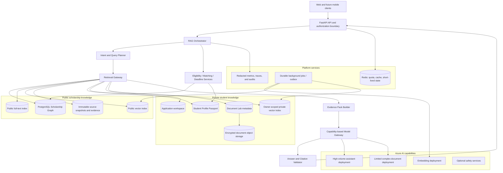
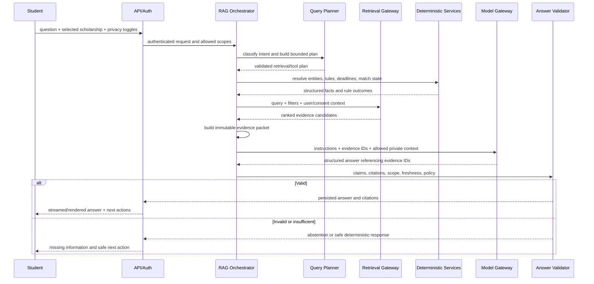
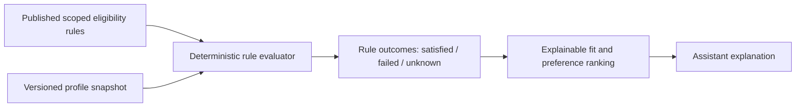

# Scholarship Intelligence RAG and AI Assistant Architecture

- **Status:** Target architecture; pre-implementation system design
- **Audience:** Product engineering, AI engineering, security, operations, reviewers, and technical interviews
- **Project:** Scholarship AI Assistant
- **Baseline:** FastAPI modular monolith, PostgreSQL, verified Scholarship Intelligence Graph, deterministic matching, private Document Lab, application command centre, citation-first assistant shell
- **Primary deployment direction:** Azure, with provider-neutral application contracts
- **Scale target:** 100,000 monthly active users initially, with a measured path beyond that level
- **Last updated:** 2026-08-30

## 1. Executive decision

The platform will use a **structured-first, evidence-grounded, privacy-partitioned RAG architecture**.

The language model is not the system of record, the eligibility authority, the retrieval security boundary, or the workflow engine. It is a constrained reasoning and communication component operating over evidence packets assembled by trusted application services.

The architecture has five cooperating intelligence layers:

1. **Scholarship Intelligence Graph** — reviewed, scoped, current-cycle scholarship truth.
2. **Deterministic decision services** — eligibility, matching, deadlines, readiness, and workflow rules.
3. **Hybrid retrieval plane** — exact entity resolution, relational filters, full-text search, vector search, fusion, reranking, and evidence-pack assembly.
4. **Private student context** — explicitly consented profile, application, and Document Lab knowledge, isolated by user and purpose.
5. **Model orchestration layer** — capability-based Azure OpenAI deployments that explain, compare, plan, and coach without inventing facts or receiving unnecessary private data.

The initial implementation should remain inside the existing modular monolith and PostgreSQL deployment. PostgreSQL remains the source of truth; PostgreSQL full-text search and pgvector are the preferred first retrieval backend. Azure AI Search is an evolution option when measured retrieval load, corpus size, operational isolation, multilingual relevance, or reranking requirements justify a separate search service.

The product is deliberately not “chat with scholarship PDFs.” It is an application operating system whose assistant can answer:

- What is true about this scholarship?
- Does each official rule apply to this student?
- What information is missing or uncertain?
- What should the student do next?
- Which private documents or application tasks need attention?
- Which source, profile fact, rule outcome, or document span supports the answer?

## 2. Product outcome

The assistant must reduce the distance between **finding an opportunity** and **submitting a complete, internally consistent application**.

Its differentiation from a general-purpose model is persistent and governed context:

- a verified scholarship graph instead of a fresh, unreviewed web search;
- a reusable Student Profile Passport instead of repeated profile pasting;
- deterministic eligibility outcomes instead of model intuition;
- an application workspace instead of isolated answers;
- exact evidence and freshness instead of plausible prose;
- document consistency across the whole application instead of one-off generation;
- proactive next actions instead of requiring the student to prompt-engineer every step.

Every decision-support response should converge on a fixed product contract:

```text
Verified answer
  + supporting evidence
  + impact on this student
  + uncertainty or missing information
  + one or more safe next actions
```

## 3. Goals and non-goals

### 3.1 Goals

The architecture must support:

- factual scholarship questions with exact official citations;
- scholarship search and comparison;
- deterministic eligibility evaluation with rule-by-rule explanations;
- profile-to-scholarship matching without claiming admission probability;
- personalized readiness and gap analysis;
- application planning and task prioritization;
- private Document Lab coaching with explicit consent;
- conversation continuity without treating chat history as truth;
- multilingual queries and cross-lingual retrieval evolution;
- source freshness, cycle rollover, conflict, and invalidation semantics;
- predictable cost and quota enforcement before provider dispatch;
- graceful degradation when the model, embeddings, vector index, or private context is unavailable;
- complete export, deletion, retention, and owner isolation of student data;
- an evolutionary path from a modular monolith to separately scaled workers and retrieval infrastructure.

### 3.2 Non-goals

The RAG system must not:

- browse the open internet during ordinary student answers;
- treat model pretraining as a scholarship source;
- infer missing deadlines, funding, eligibility, or obligations;
- make admission, scholarship-selection, or visa-success predictions without a separately validated and governed model;
- auto-submit applications;
- publish machine-extracted scholarship claims;
- allow retrieved text to execute tools or change application state;
- mix public evidence, experiential guidance, and private student content into one ungoverned index;
- use a user’s documents for another user’s answer;
- retain raw private prompts or documents indefinitely;
- require microservices, Kubernetes, or a dedicated vector database before measured demand exists;
- hard-code the product to one Azure account, tenant, endpoint, or model deployment name.

## 4. Existing foundation and architectural fit

The repository already contains most of the correct domain boundaries:

| Existing capability | Architectural role in the RAG system |
|---|---|
| Scholarship graph, cycles, tracks, institutions, programmes | Structured public truth and deterministic filtering |
| Immutable source snapshots and field evidence | Citation and provenance authority |
| Catalogue evidence blocks | Canonical retrieval units and embedding inputs |
| Evidence policy and publication readiness | Public retrieval admission gate |
| Deterministic matching and rule outcomes | Eligibility authority and explainability source |
| Student profiles | Private structured personalization context |
| Application command centre | Workflow state and next-action target |
| Document Lab | High-sensitivity private document domain |
| Assistant conversations, evidence packets, answers, citations | Existing audit and response shell |
| Durable quotas and reservations | Admission control and cost-governance foundation |
| Modular data-rights contract | Export, retention, and deletion requirements |
| Modular monolith ADR | Initial deployment and transaction boundary |

The RAG architecture extends these modules. It must not create a second scholarship database, a parallel eligibility engine, or a second private-document store.

## 5. Architectural principles

### 5.1 Structured truth before semantic similarity

Dates, amounts, countries, degree levels, route codes, institution identities, application stages, and eligibility operators are relational data. They must be resolved and filtered structurally before semantic retrieval.

Vector similarity answers “which passages may be relevant?” It does not answer “which rule is currently authoritative for this student and this route?”

### 5.2 Retrieval is a governed service, not a database shortcut

No assistant or model adapter may query vector tables, search indexes, profile tables, or document stores directly. All grounding access passes through a Retrieval Gateway that enforces:

- authenticated principal;
- user and tenant scope;
- consent and purpose;
- source trust and publication state;
- cycle and freshness rules;
- application/document ownership;
- result limits and cost budgets;
- audit of the grounding identifiers accessed.

### 5.3 Public facts and private facts have different trust semantics

- Scholarship facts are supported by official evidence.
- Eligibility conclusions are supported by official rules plus a versioned profile snapshot.
- Profile facts are “provided or confirmed by the student,” not official scholarship evidence.
- Document statements are private-document observations, not verified real-world facts.
- Recommendations and next actions are advice, not source claims.

The answer schema and UI must label these categories separately.

### 5.4 Unknown is a valid output

The system must preserve:

- confirmed value;
- confirmed absent;
- unknown;
- not applicable;
- conflicting;
- stale;
- private information not enabled;
- insufficient retrieval evidence.

No layer may convert unknown into false, zero, “No,” or a confident narrative.

### 5.5 The model has no ambient authority

The model receives only explicitly assembled context and an allowlisted set of read tools. It cannot:

- publish or edit scholarship truth;
- silently modify a profile;
- create, complete, or delete application tasks;
- send reminders or external messages;
- access arbitrary documents;
- browse arbitrary URLs;
- reinterpret access-control filters.

Any future write action requires a separate command service, deterministic validation, idempotency, authorization, and explicit user confirmation.

## 6. Quality attributes and proposed design targets

These are architecture targets, not current production claims.

| Attribute | Target or invariant |
|---|---|
| Cross-user isolation | Zero unauthorized public/private retrieval crossings |
| Critical factual grounding | Every material scholarship fact has one or more valid official citations |
| Unsupported critical claims | Zero in release-gate fixtures |
| Eligibility authority | Deterministic rules; model may explain but may not override |
| Freshness | Current-cycle filters and field-level stale/conflict visibility |
| Retrieval latency | Public index p95 target below 300 ms before generation |
| Interactive latency | First useful streamed output target below 3 seconds where provider permits |
| Complex answer latency | Bounded, observable, and cancellable; long document work moves to jobs |
| Availability | Catalogue and deterministic matching remain usable during AI outage |
| Cost | Reservation and maximum cost checked before every provider request |
| Deletion | Private raw content, derived chunks, embeddings, summaries, and caches included |
| Versioning | Every answer records retrieval, index, prompt, rule, provider, and model versions |

### 6.1 Capacity model

Monthly active users alone do not determine capacity. Planning uses:

```text
monthly_turns = MAU × active_days_per_user × sessions_per_active_day × turns_per_session

average_qps = monthly_turns ÷ seconds_in_month

peak_qps = average_qps × measured_peak_factor

monthly_model_cost = Σ(request_input_tokens × input_rate
                       + request_output_tokens × output_rate
                       + tool_or_search_costs)
```

For illustration only, 100,000 MAU with several assistant turns per active day can still produce modest average QPS but much higher evening, deadline-day, and campaign bursts. The architecture therefore scales on measured peak concurrency, token throughput, queue depth, and provider quota—not MAU alone.

## 7. Logical architecture



### 7.1 Deployment philosophy

The boxes above are logical components, not day-one microservices. Initially they are modules and workers inside the current repository. Boundaries are expressed through service interfaces, repositories, data ownership, outbox events, and configuration. Components become separate deployables only after a measured scaling, security, or fault-isolation need.

## 8. Knowledge domains and retrieval isolation

### 8.1 Domain A — published scholarship truth

Contains only approved, public, current or explicitly stale-labelled graph data:

- scholarship identity and aliases;
- cycles and statuses;
- routes/tracks;
- institutions and programmes;
- scoped eligibility rules;
- funding;
- deadlines;
- documents and application steps;
- obligations, contacts, fees, renewal, and selection stages when represented;
- reviewed field evidence.

This domain is globally shareable and cacheable, subject to freshness and publication policy.

### 8.2 Domain B — official evidence corpus

Contains immutable source snapshots and deterministic evidence blocks. It supports explanation and citation, but only evidence admitted by the publication/evidence policy may ground public factual answers.

Discovery leads, unreviewed extraction, stale critical facts, conflicts, quarantined claims, and blocked sources remain outside ordinary public-answer retrieval.

### 8.3 Domain C — private profile facts

Contains structured facts the user entered or confirmed:

- nationality and residence;
- education level and target degree;
- grades and scale;
- tests;
- work, research, publications, leadership, goals, preferences, and constraints.

Profile facts should be retrieved directly from structured storage. They generally do not require embeddings. Free-text profile fields may later receive owner-scoped embeddings for narrative coaching, but only with explicit consent and retention controls.

### 8.4 Domain D — private application state

Contains application lifecycle, tasks, deadlines, reminders, document checklist state, and student notes. It is primarily structured and should be read through the application service, not semantic search.

### 8.5 Domain E — private Document Lab knowledge

Contains encrypted files, extracted text, document spans, analyses, and application links. Raw content and derived embeddings are high-sensitivity data.

Private document retrieval requires:

- owner identity;
- explicit per-request enablement;
- valid analysis consent/notice version;
- allowed application/document IDs;
- retention validity;
- no malware/quarantine failure;
- purpose limitation.

### 8.6 Domain F — experiential guidance

Alumni stories, community guidance, and winner experiences are a separate trust tier. They can support labelled practical guidance but cannot establish official eligibility, funding, deadlines, or application rules. Experiential retrieval must never outrank or override official facts.

## 9. Source of truth versus derived indexes

| Data | Source of truth | Derived retrieval representation |
|---|---|---|
| Scholarship facts | PostgreSQL graph tables | Search document and selected textual embedding |
| Official evidence | Immutable source snapshots/evidence blocks | FTS row and embedding per admitted block |
| Eligibility result | Versioned matching evaluation and rule outcomes | Normally none; optionally searchable explanation metadata |
| Student profile | `student_profiles` and future normalized profile entities | Optional owner-scoped narrative embeddings |
| Application state | Application command-centre tables | No vector copy for normal operations |
| Private documents | Encrypted object store plus Document Lab metadata | Owner-scoped chunks/embeddings with deletion linkage |
| Conversation | Assistant conversation tables | Short-lived structured memory, not a truth corpus |

Search indexes are disposable projections. They may be rebuilt from the source of truth. They never become the only copy of a fact, citation locator, consent decision, or ownership relationship.

## 10. Canonical retrieval-unit design

### 10.1 Public evidence chunk

The existing deterministic catalogue evidence block is the base retrieval unit. A public search projection should carry at least:

| Field group | Examples |
|---|---|
| Identity | chunk ID, artifact ID, snapshot ID, content hash, canonicalization version |
| Scholarship scope | opportunity, cycle, track, institution, programme, country, degree, subject |
| Semantic scope | objective, entity type, field path, source role, language |
| Trust | officiality, owner type, verification status, validator status, support type |
| Freshness | captured, verified, cycle, active revision, stale/conflict flags |
| Locator | page/sheet/section, start/end offsets, evidence block index |
| Retrieval | searchable text, embedding, embedding model/version, index version |

Chunk text must remain immutable for a given content hash and locator. Enrichment metadata can be versioned independently.

### 10.2 Chunking policy

Chunking is structural before it is token-based:

1. Preserve the original snapshot and exact offsets.
2. Prefer headings, paragraphs, list groups, table rows, PDF layout regions, and document sections.
3. Keep one primary semantic idea per chunk where possible.
4. Add limited parent-heading context as metadata or a separate retrieval field.
5. Avoid duplicating large overlapping windows that inflate index size and result diversity.
6. Store any overlap policy and canonicalization version.
7. Never rewrite the cited source text with model-generated summaries.
8. Use summaries or keywords only as derived search aids; citations point to original evidence.

The existing 1,200-character deterministic blocks are a safe foundation. Future layout-aware blocks may coexist under a new version; they must not silently mutate old citation identities.

### 10.3 Private document chunk

A private chunk additionally carries:

- owner user ID;
- document asset and version ID;
- optional application/document link;
- document kind;
- consent purpose and version;
- retention/deletion linkage;
- sensitivity classification;
- parser and extraction versions;
- exact private document span;
- index partition/version.

Embeddings are derived personal data and must be deleted with the document/version. They are not anonymized merely because the original words cannot be read directly.

## 11. Indexing and invalidation pipeline

```mermaid
flowchart LR
    Publish[Reviewed graph or source revision]
    Outbox[Transactional outbox event]
    Select[Eligibility for indexing]
    Chunk[Canonical evidence blocks]
    Enrich[Deterministic metadata enrichment]
    Embed[Embedding job]
    Stage[Stage index revision]
    Verify[Count/hash/coverage checks]
    Activate[Atomic active-revision switch]
    Retire[Retire old projection]

    Publish --> Outbox --> Select --> Chunk --> Enrich --> Embed --> Stage --> Verify --> Activate --> Retire
```



### 11.1 Public indexing events

Index work is triggered by durable events such as:

- opportunity published or unpublished;
- proposal revision materialized;
- source snapshot admitted, invalidated, or marked conflicting;
- field evidence changed;
- cycle opened, closed, or rolled over;
- topology scope changed;
- embedding or chunking version changed.

The indexer uses idempotency key:

```text
corpus + entity/snapshot ID + content hash + chunk version
       + enrichment version + embedding deployment/version + index schema version
```

### 11.2 Change-driven behavior

- Unchanged content and compatible versions require no re-embedding.
- A changed source invalidates only linked chunks and affected graph scopes.
- Old index revisions remain resolvable for previously persisted answer citations until retention policy permits removal.
- Publication removal immediately excludes the record through an authoritative filter even if physical vector deletion is asynchronous.
- Index activation is atomic; partially indexed revisions never serve normal traffic.

### 11.3 Private indexing events

Private document chunks are indexed only after scan, extraction, explicit analysis consent, and successful owner-scoped job admission. Delete, retention expiry, consent withdrawal where applicable, or account closure creates durable deletion work for raw objects, extracted text, chunks, embeddings, summaries, and caches.

## 12. Online query flow



### 12.1 Request contract

Each assistant request should explicitly carry or derive:

- authenticated user;
- conversation ID;
- selected opportunity/application/document IDs;
- whether profile data is enabled;
- whether application data is enabled;
- whether named Document Lab content is enabled;
- expected client/request idempotency key;
- locale and timezone;
- answer mode;
- maximum latency/cost class.

No private domain is enabled merely because the user discussed it in an older conversation.

## 13. Intent and answer-mode taxonomy

| Intent | Primary authority | Retrieval mode | Model role |
|---|---|---|---|
| Scholarship fact | Published graph + official evidence | Exact entity + scoped evidence | Explain and summarize |
| Search/discovery | Structured catalogue + hybrid text | Filters + FTS/vector | Clarify and compare |
| Eligibility | Rules + profile snapshot | Deterministic rule evaluation | Explain outcomes |
| Profile fit | Match evaluation | Structured results + supporting evidence | Prioritize strengths/gaps |
| Scholarship comparison | Multiple scoped graph snapshots | Structured comparison + evidence diversity | Produce readable comparison |
| Deadline/status | Cycle/deadline resolver | Exact current-cycle lookup | Explain uncertainty |
| Application planning | Application service + official requirements | Structured workflow facts | Propose, not mutate |
| Progress prioritization | User-owned application state | Structured private query | Summarize next action |
| Document coaching | Named private document version + rubric | Owner-scoped document spans | Coach/critique within policy |
| General strategy | Product guidance + clearly labelled reasoning | Minimal or no factual retrieval | Advice with limitations |
| Visa/legal/guarantee request | Policy boundary | No retrieval needed | Refuse or redirect safely |

The planner produces a schema-validated plan. It cannot invent a tool, remove security filters, broaden document scope, or choose unlimited retrieval depth.

## 14. Retrieval pipeline

### 14.1 Stage 0 — policy and scope admission

Before search:

1. Authenticate the principal.
2. Validate feature gates and quota reservation.
3. Resolve selected public/private entity ownership.
4. Evaluate consent and purpose.
5. Fix maximum result, token, latency, and cost budgets.
6. Determine allowed corpora.

### 14.2 Stage 1 — exact entity and graph resolution

Resolve scholarship names, aliases, providers, institutions, cycles, routes, and programmes before semantic search. If the student selected a scholarship in the UI, that ID is authoritative and the query must not drift to a different scholarship because of vector similarity.

Graph resolution supplies mandatory metadata filters:

- publication state;
- active/current cycle as appropriate;
- opportunity and scope IDs;
- officiality and evidence status;
- freshness/conflict policy;
- locale/language when relevant.

### 14.3 Stage 2 — structured decision retrieval

Fetch canonical fields, eligibility rules, deadlines, funding, documents, steps, application state, and rule outcomes through domain services. Structured values are included in the evidence packet even if no vector search is needed.

### 14.4 Stage 3 — lexical retrieval

Use full-text/BM25-style retrieval for:

- scholarship and programme names;
- acronyms and route codes;
- dates, amounts, currencies, test names, and document names;
- exact phrases from official requirements;
- uncommon policy terminology.

### 14.5 Stage 4 — vector retrieval

Use vector similarity for conceptual language:

- “return to my country after study” versus “home residency obligation”;
- “professional experience” versus “employment requirement”;
- multilingual or paraphrased student queries;
- narrative document coaching.

The query is embedded with the same normalization and compatible embedding family used for indexed chunks.

### 14.6 Stage 5 — fusion

Fuse lexical and vector rankings using Reciprocal Rank Fusion or an equivalently documented method. Do not compare raw BM25 and cosine scores directly as if they were calibrated on the same scale.

### 14.7 Stage 6 — reranking

Reranking is optional and budgeted. It may use deterministic features, a search service semantic ranker, or a bounded model-based reranker. Features include:

- exact scholarship/scope match;
- current cycle;
- official trust tier;
- field/objective match;
- query-term coverage;
- freshness;
- citation availability;
- conflict/unknown penalties;
- source and section diversity.

The reranker cannot promote ineligible or unauthorized content into the allowed set.

### 14.8 Stage 7 — coverage and diversity selection

Select a small evidence set that covers the question rather than returning ten near-duplicate chunks from one page. Enforce:

- per-source and per-section caps;
- required scope coverage;
- contradictory evidence visibility;
- parent/child context where necessary;
- maximum prompt token budget;
- no irrelevant private context.

### 14.9 Stage 8 — sufficiency decision

Before generation, determine whether the evidence can support the requested answer. If a decision-critical element is missing, stale, or conflicting, the evidence packet records that condition and the answer must expose it or abstain.

## 15. Evidence packet contract

The evidence packet is an immutable, persisted record of exactly what the model was allowed to use. It should evolve beyond the current JSON snapshot while preserving backward compatibility.

Conceptually it contains:

```text
EvidencePacket
  identity
    packet_id, user_id, request_id, created_at
  versions
    retrieval, planner, index, chunking, embedding, rules, prompt, policy
  intent
    answer mode, resolved entities, locale, timezone
  authorization
    allowed corpora, consent flags, selected private IDs
  structured facts
    graph fields, effective scopes, match/rule outcomes, application state
  evidence items
    evidence_id, trust domain, source/snapshot/chunk IDs, exact locator,
    text, scope, freshness, support status, retrieval scores
  known limitations
    unknowns, conflicts, stale fields, omitted private domains
  budgets
    max context tokens, max output tokens, latency/cost class
```

The packet stores grounding text only according to its domain retention policy. Public evidence can be retained for audit. Private excerpts must use shorter retention, encryption, and deletion linkage; where possible persist identifiers and hashes rather than duplicate private text.

## 16. Generation and answer contract

### 16.1 Model input

The model receives clearly separated sections:

1. immutable system and policy instructions;
2. answer schema and allowed behaviors;
3. structured decision results;
4. public evidence blocks labelled as untrusted data;
5. explicitly enabled private context labelled by origin;
6. user question;
7. output constraints.

Retrieved content must never be concatenated into the instruction section.

### 16.2 Structured model output

The output should extend the repository’s existing structured response with typed claims:

- answer summary;
- public factual claims with evidence IDs;
- eligibility conclusions with rule-outcome IDs;
- profile observations with profile-field references;
- private document observations with document-span IDs;
- recommendations/next actions labelled as advice;
- unknowns and conflicts;
- warnings;
- abstention reason;
- proposed workflow actions that require confirmation.

The model cites stable evidence IDs, never free-form URLs or invented citation numbers.

### 16.3 Post-generation validator

The validator must check:

- schema validity;
- evidence ID membership in the packet;
- user ownership of private references;
- opportunity and scope consistency;
- freshness and evidence-policy status;
- every material public fact has citation coverage;
- deterministic numbers/dates match structured values;
- eligibility conclusions do not contradict rule outcomes;
- no acceptance/visa guarantee or unsupported probability;
- no model-created workflow mutation;
- response length and safety policy.

An invalid answer is repaired only through a bounded retry with the same evidence packet or converted to a safe abstention. It never falls back to ungrounded model knowledge.

## 17. Deterministic eligibility and personalized matching

RAG explains matching; it does not replace it.



The product must keep separate:

- **eligibility status** — rule-based;
- **profile fit** — captured evidence alignment;
- **preference fit** — student preferences;
- **evidence completeness** — scholarship data quality;
- **profile completeness** — missing student information;
- **readiness** — application work completed;
- **selection probability** — not provided unless a future separately governed model is validated.

The assistant can translate rule outcomes into plain language and request missing information. It cannot change a failed rule to “likely eligible” because the narrative sounds strong.

## 18. Student Profile Passport architecture

The current profile is a useful first structured record. The target Passport should remain user-owned and versioned, and eventually distinguish:

- user-entered facts;
- document-extracted candidate facts;
- user-confirmed facts;
- derived deterministic facts, such as experience duration;
- disputed or superseded facts;
- narrative story/achievement material.

Each fact should carry origin, confidence/status, last confirmation, and applicable privacy purpose. Document extraction must not silently overwrite profile truth. It proposes candidate facts that the student confirms.

For assistant requests, include the minimum necessary profile projection. A funding question may need no transcript or leadership story. Eligibility may need nationality, education, grades, tests, and experience but not unrelated private notes.

## 19. Document Lab RAG architecture

Document Lab is a separate high-sensitivity retrieval domain.

### 19.1 Document flow

```text
Upload
  → bounded validation
  → malware quarantine/scan
  → isolated text/layout extraction
  → encrypted storage
  → explicit analysis consent
  → owner-scoped chunking/embedding
  → rubric-specific retrieval
  → bounded model analysis
  → citation to private document spans
  → user review and optional application link
```

### 19.2 Retrieval behavior

Document analysis should retrieve by task, not dump an entire document collection into the prompt. Examples:

- CV timeline consistency retrieves education/employment date spans.
- Essay evidence coaching retrieves relevant confirmed achievements and the target scholarship’s essay requirements.
- Cross-document consistency retrieves only facts needed for the compared claims.
- Final application review retrieves named application documents and official requirements.

### 19.3 Authorship and integrity

The assistant should prioritize coaching, outlining, critique, consistency, and evidence selection. Generated writing must remain grounded in confirmed student facts. The system must reject fabricated achievements, experiences, quotations, recommenders, grades, or outcomes.

A larger model allocation should be reserved for high-value operations such as story architecture, difficult revision, or final cross-document review—not used automatically for every formatting request.

## 20. Assistant orchestration and tool boundaries

### 20.1 Start with controlled RAG

The first production assistant uses a bounded plan selected from known intents. It does not use an open-ended autonomous agent loop.

Agentic retrieval may later be introduced for genuinely multi-step questions, but with:

- maximum steps;
- allowlisted tools;
- per-step budget reservation;
- fixed authorization context;
- no self-expanded web access;
- evidence sufficiency checks;
- complete traceability.

### 20.2 Conceptual read tools

| Tool | Authority and purpose |
|---|---|
| Resolve scholarship/entity | Canonical identity and scope |
| Get published graph | Current reviewed structured facts |
| Search official evidence | Scoped hybrid retrieval |
| Evaluate eligibility | Deterministic rule outcomes |
| Get match evaluation | Existing owner-scoped ranking result |
| Get profile projection | Minimal consented fields |
| Get application progress | Owner-scoped tasks/deadlines/state |
| Retrieve document spans | Named owner-scoped document/rubric only |
| Get source freshness/conflicts | Evidence-policy decision |

### 20.3 Write actions

The assistant may propose actions such as “create a document task” or “set a reminder,” but execution follows a separate command flow:

```text
model proposal
  → schema validation
  → user-visible preview
  → explicit confirmation
  → domain command service
  → authorization and invariant checks
  → idempotent transaction
  → audit event
```

No retrieved text or model output can bypass this flow.

## 21. Conversation memory

Conversation memory is not a vector dump of all prior messages.

Use three levels:

1. **Immediate window** — a bounded number of recent turns.
2. **Structured conversation state** — selected scholarship/application, unresolved questions, user-approved goals, and current task.
3. **Durable user truth** — profile and application records, updated only through their own services.

Generated conversation summaries are untrusted derived data. They carry a version, expiry, and links to source messages. They must not override the Student Profile Passport or create facts. History-disabled conversations do not generate durable memory.

## 22. Model gateway and Azure deployment architecture

### 22.1 Capability-based routing

Application code targets capabilities, not literal model names:

| Capability | Typical use | Expected class |
|---|---|---|
| Query planning | Intent/schema classification | deterministic or small model |
| Grounded answer | Most factual/personalized assistant turns | high-volume model deployment |
| Document coaching | Routine critique and transformation | high-volume model deployment |
| Complex document review | Limited final synthesis/cross-document reasoning | larger premium deployment |
| Embeddings | Public and separately configured private indexes | embedding deployment |
| Optional reranking | High-value ambiguous retrieval | search semantic ranker or bounded model |

The intended GPT-5 mini deployment can fill the high-volume generation role after the actual Azure deployment passes capability, latency, structured-output, and cost checks. The architecture does not require it to provide embeddings; embeddings use a separately configured deployment.

### 22.2 Gateway responsibilities

The Model Gateway owns:

- provider and deployment mapping;
- Microsoft Entra managed-identity or approved secret authentication;
- timeouts and cancellation;
- retry classification without hidden duplicate billing;
- structured-output capability;
- streaming normalization;
- token and cost estimation;
- reservation and attempt ledger;
- circuit breaking and provider health;
- prompt/model/version attribution;
- private-data policy and regional routing;
- fallback eligibility.

Production should prefer managed identity where the Azure service supports it. Local development can use developer identity or a secret provider without changing domain code.

### 22.3 Fallback policy

- A model outage never causes an ungrounded fallback.
- A larger model is not an automatic fallback for quota exhaustion unless the product budget allows it.
- A small model may handle a request only when its capability receipt supports the required structured output and context.
- Deterministic catalogue, matching, and application data remain available without AI.
- Provider/account migration changes deployment configuration and receipts, not business logic.

## 23. Retrieval backend decision

### 23.1 Initial decision: PostgreSQL FTS plus pgvector

Reasons:

- aligns with the accepted modular-monolith architecture;
- keeps transactional IDs, publication state, evidence scope, and filters close together;
- avoids a second operational system during five-scholarship and early catalogue validation;
- simplifies exact deletion and owner filtering for private projections;
- supports evaluation before infrastructure commitment.

The retrieval service interface must remain backend-neutral so public retrieval can move independently later.

### 23.2 Evolution option: Azure AI Search

Move or dual-write the public retrieval projection when measurements show one or more of these conditions:

- retrieval p95 repeatedly misses its SLO after PostgreSQL query/index tuning;
- vector/FTS traffic materially degrades transactional workloads;
- index rebuilds or embedding backfills interfere with catalogue operations;
- multilingual hybrid relevance or semantic reranking provides demonstrated quality gains;
- public corpus growth requires separate scaling and fault isolation;
- operations can support index aliases, staged revisions, and reconciliation.

Private document retrieval should not automatically follow the public index. Its tenancy, deletion, encryption, and authorization design requires a separate decision and security review.

### 23.3 Rejected day-one alternatives

- Open-ended agent over raw web pages: insufficient trust and cost control.
- Vector-only search: weak for exact names, dates, codes, and numeric requirements.
- One index containing public and private content: unacceptable blast radius.
- Search service as system of record: loses relational authority and rebuild safety.
- Microservice per AI capability: premature distributed complexity.

## 24. Caching and cost architecture

### 24.1 Cache layers

| Cache | Key ingredients | Privacy rule |
|---|---|---|
| Public retrieval | normalized query, filters, graph/index revision | shareable |
| Public answer | intent, scholarship/scope, evidence packet hash, prompt/model version, locale | shareable only when no private context |
| Query embedding | normalized public query, embedding version | public queries only or owner-scoped |
| Match evaluation | profile snapshot hash, graph/rule version | user-owned |
| Private retrieval | user ID, consent scope, document versions, query hash | short TTL, owner-only |
| Conversation state | user/conversation/version | short TTL, owner-only |

No cache key may omit a security, freshness, profile, application, document, prompt, or index version that changes the answer.

### 24.2 Model-call avoidance

Do not call a model when:

- the request is a direct structured lookup the UI can render;
- a deterministic eligibility calculation answers it;
- the same public evidence packet and versioned answer already exist;
- the request is blocked by policy or lacks consent;
- required evidence is absent and the only safe result is an abstention;
- the user asks for progress that can be summarized deterministically.

### 24.3 Plan-aware budgets

Free and paid plans should translate into server-side capabilities and budgets, not client promises. Budget dimensions include:

- turns per day/month;
- input/output tokens;
- document analyses;
- complex-model allocations;
- concurrent jobs;
- retained history;
- maximum document size/pages;
- optional reranking.

Admission uses atomic Redis or database reservations before dispatch and reconciles actual or conservatively estimated provider usage afterward.

## 25. Security, privacy, and threat model

### 25.1 Data classification

| Class | Examples | Handling |
|---|---|---|
| Public verified | Published scholarship graph/evidence | Cacheable, still integrity-protected |
| Internal operational | Index revisions, safe failure codes, costs | Restricted operations access |
| Account data | Identity, preferences, conversation ownership | Encrypted, owner-scoped |
| Sensitive profile | Grades, nationality, experience, goals | Minimum-use projections, encrypted |
| Highly sensitive documents | Transcripts, CVs, essays, letters | Encrypted object storage, isolated processing, explicit consent |
| Secrets | Keys, tokens, connection strings | Managed identity/secret manager; never prompts/logs/indexes |

### 25.2 Tenant and user isolation

- Every private retrieval request carries the authenticated user ID from server-side identity, never from a model argument.
- The Retrieval Gateway applies ownership/security trimming before ranking and again when hydrating results.
- PostgreSQL row-level security is a defense-in-depth option, not a replacement for service authorization.
- Public and private indexes use separate tables/indexes/credentials or equivalent hard partitions.
- Retrieval audit records safe grounding IDs, not raw private content.

### 25.3 Prompt injection

Official pages and user documents are untrusted content even when their source is legitimate.

Mitigations:

- keep system instructions separate from retrieved data;
- explicitly state that context instructions are data and must not be followed;
- detect/flag instruction-like retrieved passages;
- do not expose privileged tools to the generation model;
- bind tools to server-side authorization and fixed arguments;
- enforce maximum agent steps;
- validate output claims and citations;
- maintain kill switches for provider, private retrieval, and document analysis;
- preserve safe incident identifiers without logging full prompts/documents.

### 25.4 Private processing

- Production provider use requires explicit approval of data-processing region and policy.
- Send only the minimum selected excerpts, not entire user histories.
- Do not log request/response bodies containing private data.
- Encrypt raw text, derived summaries, and private embeddings at rest.
- Include derived AI data in export/deletion and retention inventories.
- Restrict operators from casually viewing student content.
- Make history and document-analysis consent revocable according to the data-rights contract.

### 25.5 Azure security posture

Target posture:

- Microsoft Entra managed identity for Azure AI calls where supported;
- Key Vault for unavoidable secrets;
- private networking/private endpoints when justified by deployment tier;
- least-privilege identities separated by API, indexing worker, Document Lab worker, and operations;
- egress allowlists for private workers;
- Azure Monitor/OpenTelemetry with allowlisted attributes;
- no prompt or document bodies in default telemetry;
- separate development, staging, and production resources and identities.

## 26. Reliability and degradation model

| Failure | User-visible behavior | System behavior |
|---|---|---|
| Generation deployment unavailable | Safe provider-unavailable response | Catalogue/matching remain available; circuit opens |
| Embedding deployment unavailable | Keyword/structured retrieval where sufficient | Queue indexing/query retry; do not block exact lookup |
| Vector index unavailable | Reduced semantic recall notice where relevant | Use exact graph + FTS; never use stale unauthorized replica |
| Search index behind graph revision | Current structured answer or abstention | Filter on active revision; alert reconciliation lag |
| Public source stale/conflicting | Explicit warning/abstention | Exclude affected Tier 1 facts |
| Private context not consented | Public-only answer | Do not query private stores |
| Document parser/scanner unavailable | Document analysis unavailable | Fail closed and retain safe job state |
| Quota exhausted | Clear limit and retry/reset time | No provider dispatch |
| Validator rejects output | Safe retry or abstention | Persist failure reason and packet ID |
| Lease/worker interruption | Job remains resumable | Fenced claims and idempotent processing |

The platform must deliver useful deterministic functionality during AI degradation. AI availability is not equivalent to product availability.

## 27. Scalability and deployment evolution

### 27.1 Stage A — five scholarships and internal/beta users

- one FastAPI modular monolith;
- PostgreSQL system of record;
- PostgreSQL FTS and pgvector projection;
- Redis for distributed quotas, rate limits, and short-lived cache;
- database-backed durable jobs/outbox;
- separate catalogue and Document Lab workers;
- Azure OpenAI generation and embedding deployments behind the gateway;
- encrypted object storage.

### 27.2 Stage B — hundreds of scholarships and growing beta

- horizontally scale stateless API replicas;
- dedicated background-worker replicas by workload;
- connection pooling and query-budget enforcement;
- separate read paths/read replicas for heavy public catalogue traffic when measured;
- staged index revisions and reconciliation jobs;
- CDN/cache for public scholarship pages;
- provider concurrency/rate-aware scheduling;
- richer retrieval and end-to-end evaluation dashboards.

### 27.3 Stage C — approximately 100,000 MAU

- autoscaled API and worker pools;
- Redis high availability for quotas/cache, with database durability for financial/accounting truth;
- transactional outbox feeding Azure Service Bus or equivalent when database polling becomes a bottleneck;
- independent public retrieval deployment if PostgreSQL isolation triggers are met;
- read replicas/cache for public graph views;
- strict model concurrency allocation by plan/capability;
- regional/data-residency review;
- load shedding that preserves auth, catalogue, application state, and deterministic matching before AI generation;
- SLO-based capacity and cost forecasting.

### 27.4 Stage D — beyond 100,000 MAU

Only measured hotspots split into services. Likely candidates are:

- public retrieval/indexing;
- model gateway and quota scheduler;
- Document Lab processing;
- notification delivery;
- catalogue ingestion.

The scholarship graph, profile, and application consistency boundaries should remain relational and transactionally clear even if their read projections are distributed.

## 28. Observability

### 28.1 Per-request trace

A safe trace should connect:

```text
request
 → intent plan
 → authorization/consent decision
 → structured lookups
 → retrieval queries
 → selected evidence IDs
 → evidence packet
 → quota reservation/provider attempt
 → validation result
 → persisted answer/citations
```

Trace attributes use IDs, versions, counts, timings, safe states, and token/cost values—not student text, document text, filenames, or prompts.

### 28.2 Metrics

Retrieval:

- exact-resolution success;
- lexical/vector candidate counts;
- recall@k, MRR/nDCG where labelled;
- fusion/reranker contribution;
- evidence diversity;
- zero-result and insufficient-evidence rates;
- active-index lag and orphan projection count.

Generation:

- answer status;
- validation failure category;
- citation coverage;
- groundedness/completeness/relevance evaluation;
- input/output tokens;
- first-token and completion latency;
- exact/estimated/unknown cost;
- circuit and rate-limit events.

Product:

- time to first qualified match;
- eligibility-check completion;
- profile gap resolution;
- scholarship-to-application conversion;
- next-action completion;
- document-analysis completion;
- application readiness and submission;
- user feedback and correction rate.

Privacy/security:

- denied cross-scope retrieval attempts;
- consent-disabled requests;
- private deletion queue age;
- retention backlog;
- injection detection;
- operator access audit.

## 29. Evaluation architecture

Evaluation is a first-class subsystem, not a final demo.

### 29.1 Evaluation layers

1. **Ingestion quality** — source, scope, exact evidence, freshness, topology coverage.
2. **Index quality** — correct chunks, metadata, embeddings, revision completeness.
3. **Retrieval quality** — relevant evidence appears and unauthorized/incorrect evidence does not.
4. **Decision quality** — deterministic eligibility and matching outcomes.
5. **Generation quality** — groundedness, completeness, clarity, citation use, abstention.
6. **Workflow quality** — recommended next actions are safe, relevant, and executable.
7. **Security/privacy** — prompt injection and tenant isolation.
8. **Operations** — latency, cost, retry, degradation, and deletion.

### 29.2 Representative query set

The golden set should span:

- five launch scholarships and their different route/topology patterns;
- exact and ambiguous names;
- deadlines, funding, eligibility, documents, stages, obligations, and contacts;
- global versus route/institution/programme scopes;
- current versus historical cycles;
- unknown, conflicting, and stale answers;
- multilingual and paraphrased questions;
- profile-complete and profile-incomplete students;
- clearly eligible, clearly ineligible, and uncertain cases;
- document coaching and cross-document inconsistency;
- adversarial source/document instructions;
- unauthorized cross-user document attempts;
- questions that must abstain.

### 29.3 Release gates

Minimum non-negotiable gates:

- zero cross-user private retrieval;
- every material public fact cites admitted official evidence;
- no critical answer from stale/conflicting evidence without explicit warning/policy;
- deterministic eligibility conclusion matches stored rule outcomes;
- no admission/visa guarantee or fabricated probability;
- correct abstention when evidence is absent;
- delete/export covers derived private RAG data;
- cost and quota reservations reconcile;
- provider outage does not remove catalogue/matching access.

Quality thresholds such as recall@k and answer usefulness should be established from the real golden set rather than copied from generic benchmarks.

## 30. Versioning and reproducibility

Every persisted answer must be reproducible at the decision level even if the provider output cannot be regenerated byte-for-byte.

Record:

- graph/publication revision;
- source snapshot and field-evidence IDs;
- index and active-revision ID;
- chunking/canonicalization version;
- enrichment and embedding versions;
- query planner and retrieval versions;
- fusion/reranking configuration;
- eligibility/matcher version and profile snapshot hash;
- prompt/policy/schema version;
- provider, deployment, model/snapshot where available;
- evidence packet hash;
- quota reservation and provider attempt;
- answer-validation version.

Changes to any of these can invalidate caches or trigger targeted evaluation without overwriting historical evidence.

## 31. Module boundaries for future implementation

These are conceptual ownership boundaries, not a requirement to create one file or service per row.

| Boundary | Responsibility | Must not own |
|---|---|---|
| Knowledge projection/indexer | Build versioned public/private search projections | Publication decisions |
| Retrieval Gateway | Authorization, filtering, hybrid retrieval, ranking | Model generation |
| Query Planner | Intent and bounded retrieval/tool plan | Access-control decisions |
| Evidence Pack Builder | Assemble immutable allowed context | Invent facts |
| Eligibility/Matching | Deterministic rule evaluation and ranking | Prose generation |
| Assistant Orchestrator | Coordinate plan, retrieval, generation, validation | Direct DB shortcuts |
| Model Gateway | Provider/deployment/cost/retry/capability | Scholarship business rules |
| Answer Validator | Grounding, citation, policy, deterministic consistency | Search or workflow mutation |
| Document Lab | Private document lifecycle and analysis | Public scholarship truth |
| Application commands | Explicit idempotent workflow mutations | Autonomous model authority |
| Evaluation | Datasets, experiments, quality and release evidence | Production truth mutation |

## 32. Major trade-offs

### PostgreSQL/pgvector first versus Azure AI Search first

PostgreSQL reduces early operational complexity and preserves close relational filtering. Azure AI Search offers independent scaling, mature hybrid retrieval, and semantic-ranking capabilities. The architecture chooses PostgreSQL first and makes the public retrieval adapter replaceable, because relevance should be measured before a second data platform is introduced.

### Controlled RAG versus agentic RAG

Controlled RAG is more predictable, cheaper, and easier to secure. Agentic RAG is useful for multi-step research and dynamic query decomposition but increases cost and attack surface. The architecture begins controlled and introduces bounded agentic retrieval only for evaluated intents.

### Rich context versus privacy/cost

More context can improve personalization but increases disclosure risk, noise, latency, and cost. The architecture uses purpose-specific minimum context and explicit private-domain toggles.

### Generated documents versus coaching

One-shot generation is attractive but risks generic, inconsistent, or fabricated content. The architecture prioritizes confirmed fact banks, outlines, critique, consistency, and user-controlled revision, with limited premium generation for high-value work.

### Cached answers versus freshness

Public caching is highly valuable, but the key must include graph/evidence/index/prompt versions. Critical source changes invalidate affected answers immediately through authoritative revision filters.

## 33. Architecture acceptance checklist

Before code implementation is approved, reviewers should be able to answer “yes” to:

- Is PostgreSQL clearly the source of truth and the search index disposable?
- Are public, private profile, private application, private document, and experiential corpora separated?
- Is every private retrieval request owner- and consent-scoped before search?
- Does structured graph/rule evaluation occur before semantic generation?
- Can the system answer direct facts without a model call?
- Does the evidence packet capture exactly what the model could use?
- Can every factual sentence be mapped to official evidence or a typed private origin?
- Does the model lack direct mutation and publication authority?
- Are prompt injection and retrieved instructions treated as data?
- Are embedding, index, prompt, model, and rule versions recorded?
- Can source changes invalidate only affected projections and caches?
- Can private raw and derived data be exported and deleted?
- Can the product degrade to catalogue, matching, and application workflows during AI outage?
- Can provider/tenant/deployment changes occur through capability configuration?
- Are scaling decisions tied to measured SLOs rather than fashion?

## 34. Ninety-second interview explanation

> I designed the assistant as a structured-first RAG system, not a chatbot over documents. PostgreSQL remains the system of record for the reviewed Scholarship Intelligence Graph, scoped eligibility rules, immutable evidence, student profiles, and application state. Retrieval begins with exact entity resolution and relational filters, then combines full-text and vector search over versioned evidence blocks. A Retrieval Gateway applies publication, freshness, tenant, consent, and ownership filters before any ranking result can reach the model.
>
> The orchestrator combines deterministic eligibility outcomes with a small, diverse set of official evidence in a persisted evidence packet. Azure OpenAI receives only that bounded packet and returns a structured response referencing evidence IDs. A post-generation validator rejects unsupported facts, wrong scope, stale citations, eligibility contradictions, and unauthorized private references. The model can explain or propose actions but cannot change scholarship truth or application state.
>
> Public scholarship knowledge, private profiles, and private documents are separate retrieval domains. PostgreSQL full-text search and pgvector are sufficient for the initial modular monolith; Azure AI Search is an evolution path when measured workload or relevance gains justify independent search infrastructure. This gives the product grounded answers, deterministic decisions, strong privacy, graceful AI degradation, and a practical path to 100,000 monthly users without premature microservices.

## 35. Key references

Repository architecture contracts:

- [`decisions/0001-modular-monolith.md`](decisions/0001-modular-monolith.md)
- [`assistant-architecture.md`](assistant-architecture.md)
- [`document-lab-architecture.md`](document-lab-architecture.md)
- [`scholarship-information-contract.md`](scholarship-information-contract.md)
- [`data-rights-contract.md`](data-rights-contract.md)
- [`concurrency-control-standard.md`](concurrency-control-standard.md)

External primary guidance:

- [Microsoft: Design and develop a RAG solution on Azure](https://learn.microsoft.com/en-us/azure/architecture/ai-ml/guide/rag/rag-solution-design-and-evaluation-guide)
- [Microsoft: Hybrid search using vectors and full text in Azure AI Search](https://learn.microsoft.com/en-us/azure/search/hybrid-search-overview)
- [Microsoft: Secure multitenant RAG inferencing](https://learn.microsoft.com/en-us/azure/architecture/ai-ml/guide/secure-multitenant-rag)
- [Microsoft: RAG prompt engineering and prompt-injection considerations](https://learn.microsoft.com/en-us/azure/architecture/ai-ml/guide/rag/rag-prompt-engineering)
- [Microsoft: Azure OpenAI security building blocks and managed identity](https://learn.microsoft.com/en-us/azure/developer/ai/get-started-securing-your-ai-app)
- [OpenAI: GPT-5 Mini model capabilities](https://developers.openai.com/api/docs/models/gpt-5-mini)

## 36. Final architectural position

The platform should not attempt to outperform general models at general intelligence. It should make general intelligence operationally useful by surrounding it with verified scholarship truth, deterministic decisions, persistent student context, private document controls, workflow state, citations, cost governance, and measurable outcomes.

The durable advantage is therefore not the model. It is the governed system around the model:

```text
better data
  × correct scope
  × student context
  × deterministic decisions
  × workflow continuity
  × privacy and trust
  = better scholarship outcomes
```
